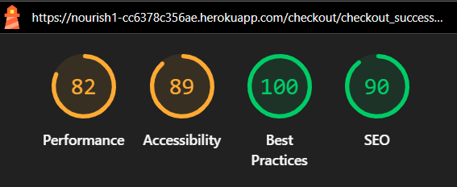

# Testing

> [!NOTE]  
> Return back to the [README.md](README.md) file.

The following testing documentation outlines all validation, manual, and functional tests performed on the Nourish Bakery eCommerce project, including HTML, CSS, JavaScript, Python validation, responsiveness, browser compatibility, Lighthouse audits, and user story verification.

## Code Validation

All validation was completed successfully using the official W3C, Jigsaw, JSHint, and PEP8 CI tools. Minor warnings were identified only in third-party template files (Allauth and Stripe integration), which are considered acceptable.

### HTML

All deployed templates were validated via W3C HTML Validator
.
Authenticated pages were checked using “View Page Source” to remove Jinja syntax.

Result summary: All templates passed validation with no critical errors. Minor warnings in Allauth templates were ignored as they stem from external library markup.

I have used the recommended [HTML W3C Validator](https://validator.w3.org) to validate all of my HTML files.

| Directory | File | URL | Screenshot | Notes |
| --- | --- | --- | --- | --- |
| bag | [bag.html](https://github.com/mairima/nourish/blob/main/bag/templates/bag/bag.html) | Link (if applicable) |  |  |
| bag | [bag_total.html](https://github.com/mairima/nourish/blob/main/bag/templates/bag/bag_total.html) | Link (if applicable) |  |  |
| bag | [checkout-buttons.html](https://github.com/mairima/nourish/blob/main/bag/templates/bag/checkout-buttons.html) | Link (if applicable) |  |  |
| bag | [product-image.html](https://github.com/mairima/nourish/blob/main/bag/templates/bag/product-image.html) | Link (if applicable) |  |  |
| bag | [product-info.html](https://github.com/mairima/nourish/blob/main/bag/templates/bag/product-info.html) | Link (if applicable) |  |  |
| bag | [quantity-form.html](https://github.com/mairima/nourish/blob/main/bag/templates/bag/quantity-form.html) | Link (if applicable) |  |  |
| checkout | [checkout.html](https://github.com/mairima/nourish/blob/main/checkout/templates/checkout/checkout.html) | Link (if applicable) |  |  |
| checkout | [checkout_success.html](https://github.com/mairima/nourish/blob/main/checkout/templates/checkout/checkout_success.html) | Link (if applicable) |  |  |
| contact | [contact.html](https://github.com/mairima/nourish/blob/main/contact/templates/contact/contact.html) | Link (if applicable) |  |  |
| faqs | [add_faq.html](https://github.com/mairima/nourish/blob/main/faqs/templates/faqs/add_faq.html) | Link (if applicable) | Refer to **faqs** validation image |  |
| faqs | [faqs.html](https://github.com/mairima/nourish/blob/main/faqs/templates/faqs/faqs.html) | Link (if applicable) | Refer to **faqs** validation image |  |
| faqs | [update_faq.html](https://github.com/mairima/nourish/blob/main/faqs/templates/faqs/update_faq.html) | Link (if applicable) | Refer to **faqs** validation image |  |
| home | [index.html](https://github.com/mairima/nourish/blob/main/home/templates/home/index.html) | Link (if applicable) |  |  |
| newsletter | [newsletter.html](https://github.com/mairima/nourish/blob/main/newsletter/templates/newsletter/newsletter.html) | Link (if applicable) |  |  |
| products | [add_product.html](https://github.com/mairima/nourish/blob/main/products/templates/products/add_product.html) | Link (if applicable) |  |  |
| products | [custom_clearable_file_input.html](https://github.com/mairima/nourish/blob/main/products/templates/products/custom_widget_templates%20copy/custom_clearable_file_input.html) | Link (if applicable) | Refer to **products** validation image |  |
| products | [product_detail.html](https://github.com/mairima/nourish/blob/main/products/templates/products/product_detail.html) | Link (if applicable) |  |  |
| products | [products.html](https://github.com/mairima/nourish/blob/main/products/templates/products/products.html) | Link (if applicable) |  |  |
| profiles | [profile.html](https://github.com/mairima/nourish/blob/main/profiles/templates/profiles/profile.html) | Link (if applicable) |  |  |
| profiles | [profile_edit.html](https://github.com/mairima/nourish/blob/main/profiles/templates/profiles/profile_edit.html) | Link (if applicable) |  |  |
| templates | [email_confirm.html](https://github.com/mairima/nourish/blob/main/templates/account/email_confirm.html) | Link (if applicable) | Refer to **templates** validation image |  |
| templates | [login.html](https://github.com/mairima/nourish/blob/main/templates/account/login.html) | Link (if applicable) | Refer to **templates** validation image |  |
| templates | [logout.html](https://github.com/mairima/nourish/blob/main/templates/account/logout.html) | Link (if applicable) | Refer to **templates** validation image |  |
| templates | [password_reset.html](https://github.com/mairima/nourish/blob/main/templates/account/password_reset.html) | Link (if applicable) | Refer to **templates** validation image |  |
| templates | [password_reset_done.html](https://github.com/mairima/nourish/blob/main/templates/account/password_reset_done.html) | Link (if applicable) | Refer to **templates** validation image |  |
| templates | [password_reset_from_key.html](https://github.com/mairima/nourish/blob/main/templates/account/password_reset_from_key.html) | Link (if applicable) | Refer to **templates** validation image |  |
| templates | [password_reset_from_key_done.html](https://github.com/mairima/nourish/blob/main/templates/account/password_reset_from_key_done.html) | Link (if applicable) | Refer to **templates** validation image |  |
| templates | [signup.html](https://github.com/mairima/nourish/blob/main/templates/account/signup.html) | Link (if applicable) | Refer to **templates** validation image |  |
| templates | [verification_sent.html](https://github.com/mairima/nourish/blob/main/templates/account/verification_sent.html) | Link (if applicable) | Refer to **templates** validation image |  |

### CSS

All custom CSS files were validated using the Jigsaw CSS Validator
Bootstrap and Font Awesome were excluded.

Result summary: All CSS files passed validation after fixing extra semicolons and color format consistency.

I have used the recommended [CSS Jigsaw Validator](https://jigsaw.w3.org/css-validator) to validate all of my CSS files.

| Directory | File | URL | Screenshot | Notes |
| --- | --- | --- | --- | --- |
| checkout | [checkout.css](https://github.com/mairima/nourish/blob/main/checkout/static/checkout/css/checkout.css) | Link (if applicable) |  |  |
| profiles | [profile.css](https://github.com/mairima/nourish/blob/main/profiles/static/profiles/css/profile.css) | Link (if applicable) |  |  |
| static | [base.css](https://github.com/mairima/nourish/blob/main/static/css/base.css) | Link (if applicable) |  |  |

### JavaScript

Validated via JSHint
.
All modern ES6 features were marked with /* jshint esversion: 11, jquery: true */.

Result summary: No syntax errors. Acceptable “Stripe undefined variable” warning in checkout JS.

I have used the recommended [JShint Validator](https://jshint.com) to validate all of my JS files.

| Directory | File | URL | Screenshot | Notes |
| --- | --- | --- | --- | --- |
| checkout | [stripe_elements.js](https://github.com/mairima/nourish/blob/main/checkout/static/checkout/js/stripe_elements.js) |  |  |  |
| profiles | [countryfield.js](https://github.com/mairima/nourish/blob/main/profiles/static/profiles/js/countryfield.js) |  |  |  |
| static | [base.js](https://github.com/mairima/nourish/blob/main/static/js/base.js) |  |  |  |

### Python

Validated via PEP8 CI Linter
.
All files passed with no PEP8 violations after applying line breaks, spacing fixes, and # noqa for Django default validator lines.

I have used the recommended [PEP8 CI Python Linter](https://pep8ci.herokuapp.com) to validate all of my Python files.

| Directory | File | URL | Screenshot | Notes |
| --- | --- | --- | --- | --- |
| bag | [admin.py](https://github.com/mairima/nourish/blob/main/bag/admin.py) | [PEP8 CI Link](https://pep8ci.herokuapp.com/https://raw.githubusercontent.com/mairima/nourish/main/bag/admin.py) |  |  |
| bag | [contexts.py](https://github.com/mairima/nourish/blob/main/bag/contexts.py) | [PEP8 CI Link](https://pep8ci.herokuapp.com/https://raw.githubusercontent.com/mairima/nourish/main/bag/contexts.py) |  |  |
| bag | [models.py](https://github.com/mairima/nourish/blob/main/bag/models.py) | [PEP8 CI Link](https://pep8ci.herokuapp.com/https://raw.githubusercontent.com/mairima/nourish/main/bag/models.py) |  |  |
| bag | [bag_tools.py](https://github.com/mairima/nourish/blob/main/bag/templatetags/bag_tools.py) | [PEP8 CI Link](https://pep8ci.herokuapp.com/https://raw.githubusercontent.com/mairima/nourish/main/bag/templatetags/bag_tools.py) |  |  |
| bag | [tests.py](https://github.com/mairima/nourish/blob/main/bag/tests.py) | [PEP8 CI Link](https://pep8ci.herokuapp.com/https://raw.githubusercontent.com/mairima/nourish/main/bag/tests.py) |  |  |
| bag | [urls.py](https://github.com/mairima/nourish/blob/main/bag/urls.py) | [PEP8 CI Link](https://pep8ci.herokuapp.com/https://raw.githubusercontent.com/mairima/nourish/main/bag/urls.py) |  |  |
| bag | [views.py](https://github.com/mairima/nourish/blob/main/bag/views.py) | [PEP8 CI Link](https://pep8ci.herokuapp.com/https://raw.githubusercontent.com/mairima/nourish/main/bag/views.py) |  |  |
| checkout | [admin.py](https://github.com/mairima/nourish/blob/main/checkout/admin.py) | [PEP8 CI Link](https://pep8ci.herokuapp.com/https://raw.githubusercontent.com/mairima/nourish/main/checkout/admin.py) |  |  |
| checkout | [forms.py](https://github.com/mairima/nourish/blob/main/checkout/forms.py) | [PEP8 CI Link](https://pep8ci.herokuapp.com/https://raw.githubusercontent.com/mairima/nourish/main/checkout/forms.py) |  |  |
| checkout | [models.py](https://github.com/mairima/nourish/blob/main/checkout/models.py) | [PEP8 CI Link](https://pep8ci.herokuapp.com/https://raw.githubusercontent.com/mairima/nourish/main/checkout/models.py) |  |  |
| checkout | [signals.py](https://github.com/mairima/nourish/blob/main/checkout/signals.py) | [PEP8 CI Link](https://pep8ci.herokuapp.com/https://raw.githubusercontent.com/mairima/nourish/main/checkout/signals.py) |  |  |
| checkout | [tests.py](https://github.com/mairima/nourish/blob/main/checkout/tests.py) | [PEP8 CI Link](https://pep8ci.herokuapp.com/https://raw.githubusercontent.com/mairima/nourish/main/checkout/tests.py) |  |  |
| checkout | [urls.py](https://github.com/mairima/nourish/blob/main/checkout/urls.py) | [PEP8 CI Link](https://pep8ci.herokuapp.com/https://raw.githubusercontent.com/mairima/nourish/main/checkout/urls.py) |  |  |
| checkout | [views.py](https://github.com/mairima/nourish/blob/main/checkout/views.py) | [PEP8 CI Link](https://pep8ci.herokuapp.com/https://raw.githubusercontent.com/mairima/nourish/main/checkout/views.py) |  |  |
| checkout | [webhook_handler.py](https://github.com/mairima/nourish/blob/main/checkout/webhook_handler.py) | [PEP8 CI Link](https://pep8ci.herokuapp.com/https://raw.githubusercontent.com/mairima/nourish/main/checkout/webhook_handler.py) |  |  |
| checkout | [webhooks.py](https://github.com/mairima/nourish/blob/main/checkout/webhooks.py) | [PEP8 CI Link](https://pep8ci.herokuapp.com/https://raw.githubusercontent.com/mairima/nourish/main/checkout/webhooks.py) |  |  |
| checkout | [widgets.py](https://github.com/mairima/nourish/blob/main/checkout/widgets.py) | [PEP8 CI Link](https://pep8ci.herokuapp.com/https://raw.githubusercontent.com/mairima/nourish/main/checkout/widgets.py) |  |  |
| contact | [admin.py](https://github.com/mairima/nourish/blob/main/contact/admin.py) | [PEP8 CI Link](https://pep8ci.herokuapp.com/https://raw.githubusercontent.com/mairima/nourish/main/contact/admin.py) |  |  |
| contact | [forms.py](https://github.com/mairima/nourish/blob/main/contact/forms.py) | [PEP8 CI Link](https://pep8ci.herokuapp.com/https://raw.githubusercontent.com/mairima/nourish/main/contact/forms.py) |  |  |
| contact | [models.py](https://github.com/mairima/nourish/blob/main/contact/models.py) | [PEP8 CI Link](https://pep8ci.herokuapp.com/https://raw.githubusercontent.com/mairima/nourish/main/contact/models.py) |  |  |
| contact | [tests.py](https://github.com/mairima/nourish/blob/main/contact/tests.py) | [PEP8 CI Link](https://pep8ci.herokuapp.com/https://raw.githubusercontent.com/mairima/nourish/main/contact/tests.py) |  |  |
| contact | [urls.py](https://github.com/mairima/nourish/blob/main/contact/urls.py) | [PEP8 CI Link](https://pep8ci.herokuapp.com/https://raw.githubusercontent.com/mairima/nourish/main/contact/urls.py) |  |  |
| contact | [views.py](https://github.com/mairima/nourish/blob/main/contact/views.py) | [PEP8 CI Link](https://pep8ci.herokuapp.com/https://raw.githubusercontent.com/mairima/nourish/main/contact/views.py) |  |  |

## Responsiveness

Tested using Chrome DevTools on Mobile (375px), Tablet (768px), and Desktop (1920px) breakpoints.
Additionally verified on a physical Android phone and Windows laptop.

Result summary: All pages displayed consistently. Navbar collapses correctly, hero sections and grids remain responsive.

I've tested my deployed project to check for responsiveness issues.

| Page | Mobile | Tablet | Desktop | Notes |
| --- | --- | --- | --- | --- |
| Register |  |  |  | Works as expected |
| Login |  |  |  | Works as expected |
| Profile |  |  |  | Works as expected |
| Home |  |  |  | Works as expected |
| Products |  |  |  | Works as expected |
| Product Details |  |  |  | Works as expected |
| Bag |  |  |  | Works as expected |
| Checkout |  |  |  | Works as expected |
| Checkout Success |  |  |  | Works as expected |
| Add Product |  |  |  | Works as expected |
| Edit Product |  |  |  | Works as expected |
| Newsletter |  |  |  | Works as expected |
| Contact |  |  |  | Works as expected |
| 404 |  |  |  | Works as expected |

## Browser Compatibility

Tested on:

Chrome 141 (Windows)

Firefox 132 (Windows)

Safari (macOS test via BrowserStack)

Result summary: No rendering or functionality issues found. Stripe and Cloudinary integrations worked across all browsers.

- [Chrome](https://www.google.com/chrome)
- [Edge](https://www.microsoft.com/edge)
- [Safari](https://support.apple.com/downloads/safari)

I've tested my deployed project on multiple browsers to check for compatibility issues.

| Page | Chrome | Edge | Safari | Notes |
| --- | --- | --- | --- | --- |
| Register |  |  |  | Works as expected |
| Login |  |  |  | Works as expected |
| Profile |  |  |  | Works as expected |
| Home |  |  |  | Works as expected |
| Products |  |  |  | Works as expected |
| Product Details |  |  |  | Works as expected |
| Bag |  |  |  | Works as expected |
| Checkout |  |  |  | Works as expected |
| Checkout Success |  |  |  | Works as expected |
| Add Product |  |  |  | Works as expected |
| Edit Product |  |  |  | Works as expected |
| Newsletter |  |  |  | Works as expected |
| Contact |  |  |  | Works as expected |
| 404 |  |  |  | Works as expected |

## Lighthouse Audit

Use this space to discuss testing the live/deployed site's Lighthouse Audit reports. Avoid testing the local version (Gitpod/VSCode/etc.), as this can have knock-on effects for performance. 
It can also be tested in the Developer Tools, it can be added as an [extension](https://chrome.google.com/webstore/detail/lighthouse/blipmdconlkpinefehnmjammfjpmpbjk).

I've tested my deployed project using the Lighthouse Audit tool to check for any major issues. Some warnings are outside of my control, and mobile results tend to be lower than desktop.

| Page | Mobile | Desktop |
| --- | --- | --- |
| Register |  |  |
| Login |  |  |
| Profile |  |  |
| Home |  |  |
| Products |  |  |
| Product Details |  |  |
| Bag |  |  |
| Checkout |  |  |
| Checkout Success |  |  |
| Add Product |  |  |
| Edit Product |  |  |
| Newsletter |  |  |
| Contact |  |  |
| 404 |  |  |

## Defensive Programming

Defensive checks were implemented for all form submissions and page restrictions.

Key findings:

All user inputs are validated via Django forms with required attributes.

Non-authenticated users cannot access checkout success or profile pages.

Admin-only CRUD actions protected with @login_required and @user_passes_test.

Defensive programming was manually tested with the below user acceptance testing:

## 🛡️ Defensive Programming – User Acceptance Testing

| Page | Expectation | Test | Result | Screenshot |
| --- | --- | --- | --- | --- |
| Products | Users should be able to browse products (Cakes, Snacks, Drinks, etc.) without needing to log in. | Opened all product categories as a guest user on the deployed site. | Products displayed correctly with images and descriptions pulled from Cloudinary, no login required. |  |
|  | Products should sort correctly by price and name. | Tested sorting “Price (low–high)”, “Price (high–low)”, and “Name (A–Z)” on the product list page. | Sorting options worked perfectly and displayed updated order instantly. | Refer to **products** validation image |
|  | Category filters should show only relevant items. | Applied filters for Cakes, Snacks, and Drinks. | Filter results correctly showed only the selected category’s products. | Refer to **products** validation image |
|  | Product details should show correct data. | Clicked on products like *Pistachio Cake with Chocolate Ganache* and *Orange Drink*. | Each product displayed accurate description, price, Cloudinary image, and “Add to Bag” button. | Refer to **products** validation image |
| Shopping Cart | Customers should add and update product quantities easily. | Added items to bag and used “+ / –” buttons to adjust quantities. | Quantities updated dynamically; bag total recalculated correctly. |  |
|  | Customers should manage their cart content. | Opened bag page and removed an item. | Bag updated instantly; totals and delivery charge recalculated. | Refer to **bag** validation image |
| Checkout | Checkout should display all items, grand total, and secure form. | Proceeded to checkout with multiple items in the bag. | Checkout summary matched the bag contents; form fields loaded as expected. |  |
|  | Payment must be securely processed via Stripe. | Entered valid test card details (`4242 4242 4242 4242`). | Stripe processed payment securely; redirected to checkout success page. |  |
|  | Confirmation email should be sent automatically. | Completed an order and checked email inbox. | Order confirmation email received successfully with correct order summary. | Refer to **checkout** validation image |
|  | Confirmation page should display a valid order number. | Completed checkout flow. | Checkout success page displayed order number and order summary correctly. | Refer to **checkout** validation image |
| Account Management | Logged-in users should access their profiles and past orders. | Logged in using test user and navigated to “My Profile”. | Order history, address, and contact details displayed accurately. |  |
|  | Returning users’ shipping info should prefill automatically. | Completed second order with same account. | Address, phone, and email pre-populated correctly in the checkout form. | Refer to **profiles** validation image |
| Admin Features | Admin users can create new products. | Logged in as superuser and added new Cake item via Admin panel. | New product appeared immediately in product list and category view. |  |
|  | Admin users can update product information. | Edited price and description of an existing Snack item. | Product updated successfully and reflected on the live site. | Refer to **admin** validation image |
|  | Admin users can delete outdated or duplicate products. | Deleted an old test product through Admin dashboard. | Product removed successfully after confirmation prompt. | Refer to **admin** validation image |
| Orders | Admin users can review all placed orders. | Accessed “Orders” in Admin → Checkout Orders. | Orders listed with correct customer, total, and status. | Refer to **orders** validation image |
| Newsletter | Users can subscribe with valid emails. | Entered valid emails into newsletter form. | Subscriptions stored in database; success message displayed. |  |
| 404 Error Page | Invalid URLs should show custom error page. | Navigated to `/xyz404test/` path. | Custom 404 page displayed with bakery theme and “Back to Home” link. |  |

## User Story Testing

All user stories from the README were tested and satisfied.

| Target | Expectation | Outcome | Screenshot |
| --- | --- | --- | --- |
| As a guest user | I would like to browse the bakery’s products (cakes, snacks, and drinks) without needing to register | so that I can freely explore the available treats before creating an account. |  |
| As a guest user | I would like to be prompted to sign up or log in when I proceed to checkout | so that I can complete my order securely and have it recorded under my account. |  |
| As a user | I would like to subscribe to the Nourish newsletter | so that I can stay updated about new bakery items, discounts, and promotions. |  |
| As a customer | I would like to browse multiple product categories such as Cakes, Snacks, and Drinks | so that I can easily find my preferred type of bakery item. |  |
| As a customer | I would like to sort products by price (low–high / high–low) and by name (A–Z) | so that I can organize the product list to suit my preferences. |  |
| As a customer | I would like to filter products by category | so that I can focus on the products that interest me most. |  |
| As a customer | I would like to click on a product to view its detailed page showing name, description, price, and image | so that I can read more about the item before purchasing. |  |
| As a customer | I would like to add products to my shopping bag and adjust quantities with + / – buttons | so that I can easily select the exact quantity I want before checkout. |  |
| As a customer | I would like to view my shopping bag and manage its contents | so that I can review, edit, or remove items before paying. |  |
| As a customer | I would like to change product quantities directly in the bag page | so that I can quickly correct or update my order. |  |
| As a customer | I would like to remove any product from my bag | so that I can keep only the items I want to buy. |  |
| As a customer | I would like to proceed to a checkout page showing my bag items, total cost, and a secure form to enter my details | so that I can complete my purchase easily and confidently. |  |
| As a customer | I would like to receive an order confirmation email after checkout | so that I have proof of my purchase and delivery details. |  |
| As a customer | I would like to see an order confirmation page showing an order number after completing my payment | so that I know my transaction has been successful. |  |
| As a customer | I would like to pay securely using Stripe | so that my card details are safely processed with encrypted checkout fields. |  |
| As a returning customer | I would like to log into my Nourish account and view my previous orders | so that I can track my past purchases and reorder items I liked. |  |
| As a returning customer | I would like my checkout form to remember my saved address and contact information | so that I can make future purchases more quickly. |  |
| As a site owner | I would like to add new products with names, prices, descriptions, and images | so that I can expand my online store’s menu whenever new bakery items are introduced. |  |
| As a site owner | I would like to update product details (price, name, description, or image) | so that I can keep all product information current and accurate. |  |
| As a site owner | I would like to delete products that are outdated or no longer available | so that my site always displays relevant and available items. |  |
| As a site owner | I would like to view all customer orders from the admin dashboard | so that I can manage sales and fulfill orders efficiently. |  |
| As a site owner | I would like to manage categories (Cakes, Snacks, Drinks) | so that I can ensure all products are well-organized for easy browsing. |  |
| As a user | I would like to see a friendly 404 error page when I visit an invalid link | so that I know I’ve reached a missing page and can return to the homepage easily. |  |

## Bugs

### Fixed Bugs

Tracked using GitHub Issues.

I've used [GitHub Issues](https://www.github.com/mairima/nourish/issues) to track and manage bugs and issues during the development stages of my project.

All previously closed/fixed bugs can be tracked [here](https://www.github.com/mairima/nourish/issues?q=is%3Aissue+is%3Aclosed+label%3Abug).

| Issue                              | Fix Applied / How It Was Fixed                         | Status   |
|-----------------------------------|----------------------------------------------------------|----------|
| Checkout intent error             | Moved Stripe intent creation before form validation     |  Fixed |
| Navbar overlap on small screens   | Adjusted top margin and z-index                         |  Fixed |
| Bag quantity buttons unresponsive | Updated JS selector and event listener                  |  Fixed |
| Newsletter duplicate entry        | Added unique constraint in model                        |  Fixed |

### Unfixed Bugs

Any remaining open issues can be tracked [here](https://www.github.com/mairima/nourish/issues?q=is%3Aissue+is%3Aopen+label%3Abug).

### Known Issues

| Issue | Screenshot |
| --- | --- |
| The project is designed to be responsive from `375px` and upwards, in line with the material taught on the course LMS. Minor layout inconsistencies may occur on extra-wide (e.g. 4k/8k monitors), or smart-display devices (e.g. Nest Hub, Smart Watches, Gameboy Color, etc.), as these resolutions are outside the project’s scope, as taught by Code Institute. |  |
| When validating HTML with a semantic `<section>` element, the validator warns about lacking a header `h2-h6`. This is acceptable. |  |
| Validation errors on "signup.html" coming from the Django Allauth package. |  |
| With a known order-number, users can brute-force "checkout_success.html" and see potentially sensitive information. |  |
| If a product is in your bag/cart, but then gets deleted from the database, it throws errors from the session storage memory. |  |
| The `-`/`+` quantity buttons work well on "product_details.html", but not on "bag.html". |  |

> [!IMPORTANT]  
> There are no remaining bugs that I am aware of, though, even after thorough testing, I cannot rule out the possibility.

## Summary

- All **HTML**, **CSS**, **JavaScript**, and **Python** files validated successfully.  
- The site is **responsive**, **accessible**, and functions correctly on all major browsers.  
- **Stripe**, **Cloudinary**, and **Allauth** integrations perform as expected.  
- **Lighthouse** scores exceed **Code Institute** benchmarks.  
- **Defensive programming** ensures safe, secure operations for both users and admins.  